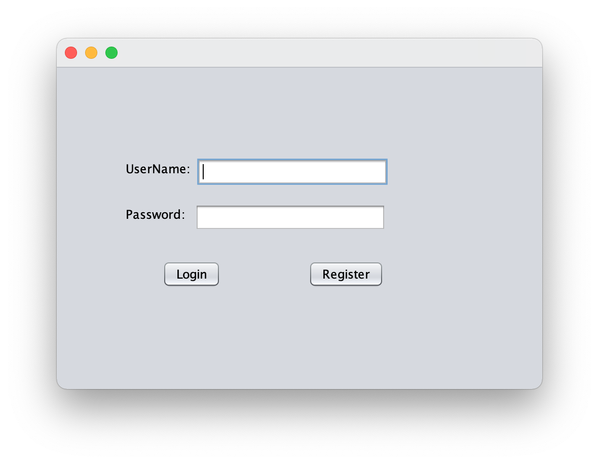
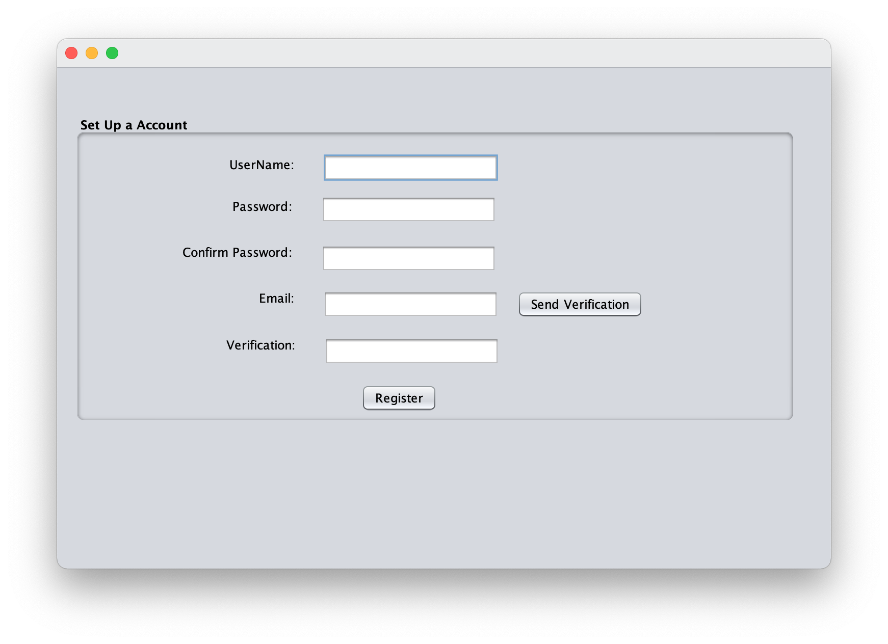
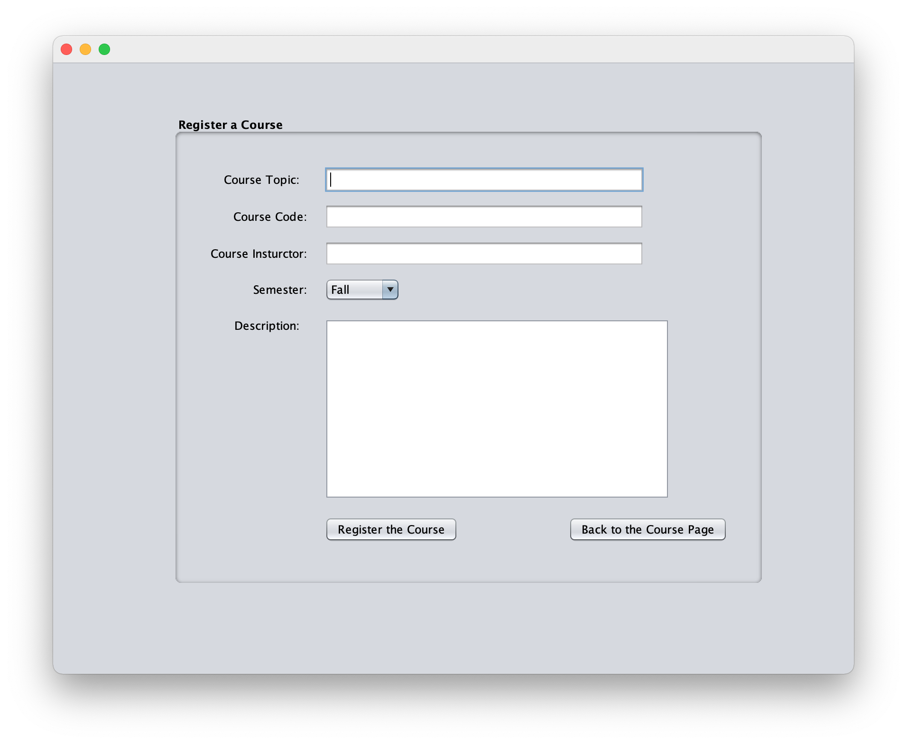
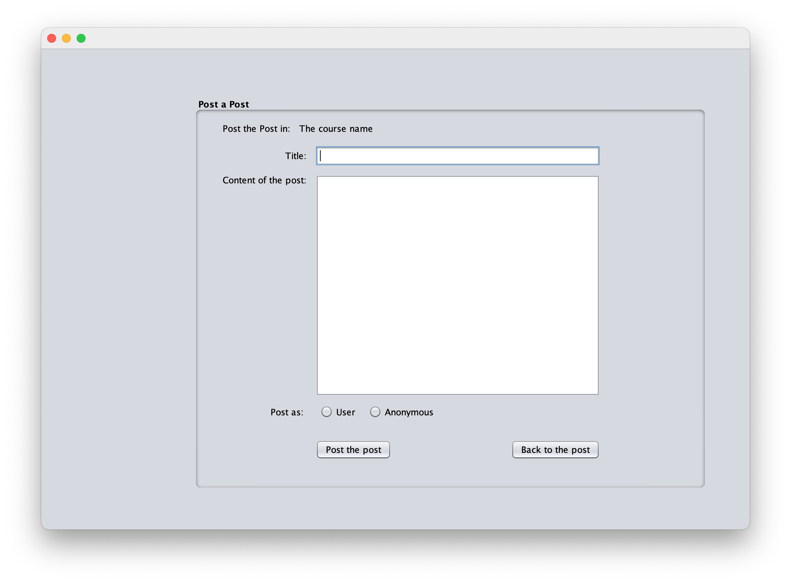
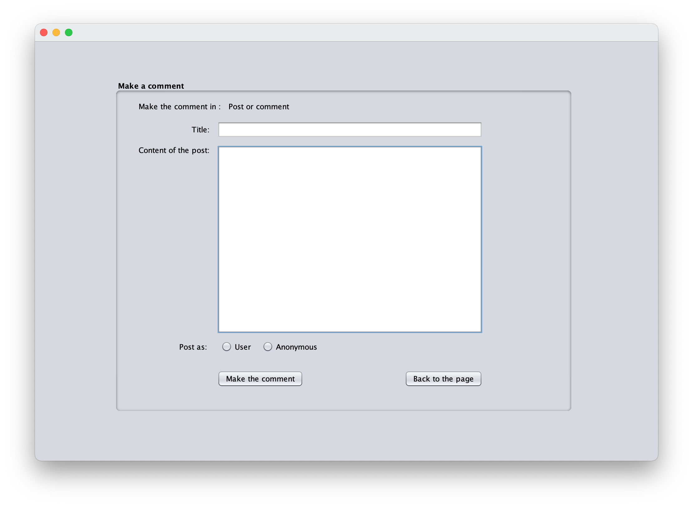
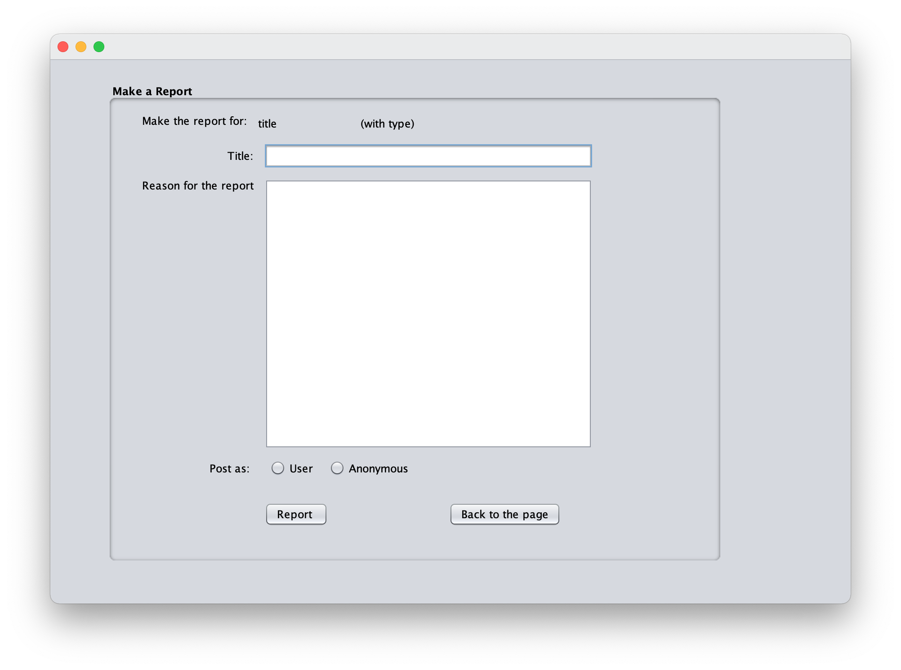
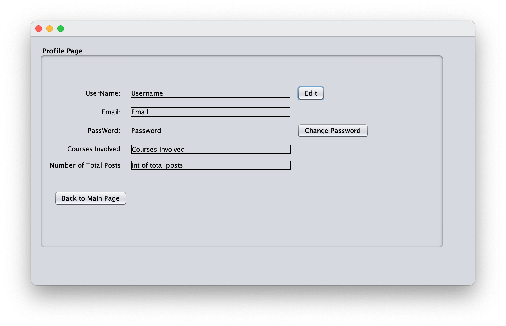
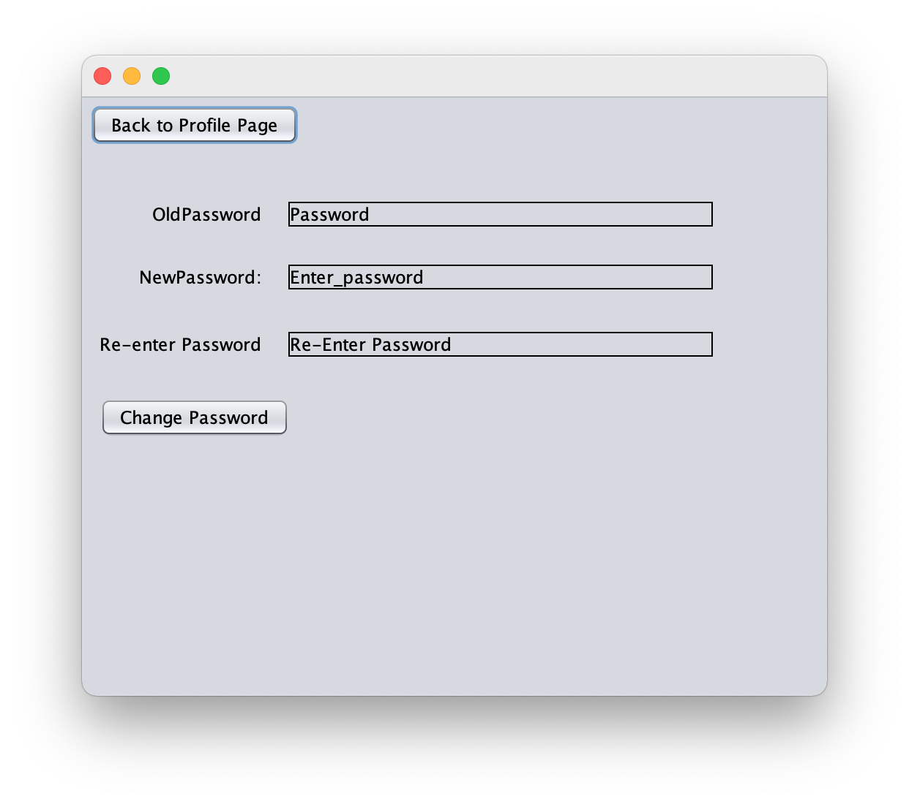

# Group 140 CSC207 project: Q/A forum

## Group members (alphabetical order by last name):

- Chihan Cui ([HermesCui](https://github.com/HermesCui))
- Qianjun Huang ([cang-xue](https://github.com/cang-xue))
- Liwei Yang ([Blair Yang](https://github.com/blairyeung))
- Jiawei Yu ([JY3150](https://github.com/JY3150))
- Gangquan Zhang ([jasongangquanzhang](https://github.com/jasongangquanzhang))
- Xiling Zhao ([Teinble](https://github.com/Teinble))
- Yuyang Zhao ([NerverSoGoodStart](https://github.com/NeverSoGoodStart))
- Jiajie Zhu ([Christinjiajie](https://github.com/Christinjiajie))

# Introduction

## 0. Design patterns
We used the following design patterns in our project.
* Dependency injection
* Observer

## 1. Entities

### 1.1 User.java

`User.java` is a class that is used to store the data of each individual user/administrator of the forum. It implements
the `Serializable` interface for serialization.

The user object has the following attributes:
* `username`
* `userid`
* `password`
* `email`

The entity provides interfaces for other functions to modify the username, password, and email. The userid, however,
is immutable once registration.
### 1.2 Course.java
Course.java is a class that is used to store the data of each specific course registrated on the forum.
\
The course object  has the following attributes:
* `name`
* `courseCode`
* `description`
* `instructors`
* `semester`
* `posts`

Most attributes for the course objects, once created, are immutable. The object only provides two
functions to add/remove students.
### 1.3 Post.java
Post.java is a class that is used to store the data of the posts in the forum. \
The posts has the following attributes:
* `topic`
* `texts`
* `comments`
* `user`
* `likedUser`
* `unlikedUser`

The post object, once created, are modifiable, and can be commented by other user objects. \
Some attributes, however, like the user who posted this thread, is immutable and viewable to everyone.
### 1.4 Comment.java
Comment.java is a class that used to store the data of each comment to a post.\
The posts has the following attributes.
* `texts`
* `comments`
* `user`

The comment object is very similar to a post. However, it must be attached to a post or another comment.
### 1.5 Report.java
Comment.java is a class that used to store the data of a report of a problem in a forum to be viewed and resolved by the administrator.\
The posts has the following attributes.
* `type`
* `content`
* `user`

All of the information of the Report object, once created, are immutable.
## 2. Use cases
### 2.1 Course use case
The course use case provides interface to create, modify, and delete course information. It has following functions:

* `getAllCourses()`
  * Fetch all courses previously registered. No input parameters is needed.
* `addCourse()`
  * Takes in the course information, attempts to create the course and
    return `true` if succeeds. If the course already exists, it will throw
  an `DuplicationException`; if the course information are invalid, it will throw
  an EmptyEntryException.

* `modifyCourse()`
  * Takes in the course information, attempts to modify the course. 
  * If the course does not exist, do nothing and throw an exception.

* **deleteCourse()**
  * Takes in the course information, attempts to delete the course and
    return *true* if succeeds. If the course information does not match, 
  do nothing and throw an exception

### 2.2 Login use case
// TODO

### 2.3 User use case
// TODO

### 2.4 Post use case
// TODO

### 2.5 Report use case
// TODO

## 3. Database
### 3.1 Data storage
We used three classes to handle the data, being `DatabaseDataHandler`, `RuntimeDataHandler`, and `DatabaseGateway`. \
\
The use cases andcontrollers interacts with `DatabaseGataway` to set, get, and edit the (non-attributive) data. \
\
`DatabaseGataway` implements three data interfaces, being 
`CourseDataInterface`, `UserDataInterface`, `ReportDataInterface`.
It has the following methods that could be called for data handling:
* `getAllUsers()`, `getAllCourses()`, `getAllReports()` \
Which fetches and returns all of the above data from the database.
* `getUser()`, `getCourse()`, `getPost()` \
Which gets the corresponding `user`, `course`, and `post` from their
`username`, `code`, and `title`, respectively, in ***O(1)***.
* `addUser`, `addReport`, `addCourse`
* `deleteUser`, `delete
### Use of data structure
The run-time data are stored in the `RuntimeDataHandler`, in the following way:
* `ArrayList<User> users`
* `ArrayList<Course> courses`
* `ArrayList<Report> reports `

The actual objects are stored in these `ArrayLists`. Furthermore, we
made use of `Hashmaps` to achieve a better `time-complexity`, and look up.
* `Hashmap name2User`
* `Hashmap email2User`
* `Hashmap code2Course`
* `Hashmap type2Report`

Using these `Hashmaps`, our database provides *O(1)* complexity for 
searching and fetching.

### Serialization
We serialized the data as a single object called 
`Hashmap<Integer, Object> Info`. The hashmap has the following structure.

| `key` | `value`     | `type`              | Serializable object | Non-native Attributes                   |
|-------|-------------|---------------------|---------------------|-----------------------------------------|
| `1`   | all users   | `ArrayList<User>`   | `User`              | `null`                                  |
| `2`   | all courses | `ArrayList<Course>` | `Course`            | `null`                                  |
| `3`   | all reports | `ArrayList<Report>` | `Report`            | `user`, `course`, `Arraylist<Comments>` |
The a

## 4. Controllers
## 5. Graphical User Interface (GUI)

### Figure 1.1 Login InterFace

This is the first interface showed when opening the project.
The `User` should enter his/her **UserName** and his/her **Password**, then he/she needs to press `Login` to enter `Courses Page`.

If this is the first time that the user is opening this application, the user should press `Register` to enter `RegisterPage`.

### Figure 1.2 Register InterFace

After clicking **Register** and entering `RegisterPage`, user should fill
the first four information into the TextField, including Username, Password, Re-EnterPassword and Email.

After entering the Email, the user should click **Send Verification**, Then, it will check
whether the entered email is valid or not. If valid, there will be text under **Send Verification** to
tell the user that an email containing verification code has already been sent to the given email address.
Then the user needs to enter the verification code and clicks `Register`.
If the verification code matches with the sending code, the user account would be created and go back to  
`LoginPage`. Otherwise, an error message would be raised.

### Figure 2.1 Courses Page
/CoursesForm.png)
After successfully logging in, the user will enter the `Courses Page`.

In the left panel of the page, it shows all the courses with their titles stored in the system.
Click one of the courses, the description of the course will appear on the right.

To see all posts in the chosen course, click **Show all Posts** to enter `Postpage`.

If there are any problem of the courses, click **Report this Course** to enter `ReportPage`.

In this page, User could click the top left button, **Register A new Course** and go to `MakeACourse Page`.

### Figure 2.2 Post Page
/PostForm.png)

In the top left of `Post Page`, it shows this is the posts page of the chosen course.

In the left panel of the page, it shows all the posts in the course.

Click one of the post, the information of that post would appear on the right.

To see all comments in the chosen course, click **Show all comments** to enter `CommentPage`.

If the user want to have more discussion, he/she could click **Comment this Post** button to go to `CommentPage`.

If there are any problems of the posts, click **Report this post** to enter `ReportPage`.

In this page, user could click the top button, **Post a Post**, and go to `MakeAPost Page`.

### Figure 2.3 Comments Page
/CommentsForm.png)

In the top left of this page, it shows this is the comments page of the chosen post or comment.

In the left panel of the page, it shows all the comments with their title in post/comment.

Click one of the comment, the information of that comment would appear on the right.

If the user wants to do more discussion, he/she could click **Comment this Post** button to go to `Make A Comment`.

If there are any problems of the comment, click **Report this Comment** to enter `ReportPage`.

In this page, User could click the top button, **Back to upper-level** and go to `MakeAPost Page`.

### Figure 3.1 Register A Course

User enter all needed information and select one of "Fall", "Winter", "Summer"
from the Semester ComboBox.

After filling in all the correct information, the user could click the **Register the Course** to get enrolled in the Course
and go back to `Course Page`.

If the user wants to skip registering the course, he/she also could go back to `CoursePage` by clicking **Back to the Course Page**.

### Figure 3.2 Make A Post

In this page, the user needs to fill in all needed information for a post.

In the top label, it shows the course that this post will belong to.

After filling in all the information, the user could click **Post the post**
and go back to `Course Page`.

The user also could choose to post anonymously or not by selecting the comboButtons.

If the user wants to skip making the post, he/she also could go back to `PostPage` by clicking **Back to the Course Page**.

### Figure 3.3 Make A Comment

In this page, the user needs to fill in all needed information for a comment.

In the top label, it shows it is under which post/comment.

After filling in all the information, the user could click **Make the comment** to make a comment
and go back to PostPage/CommentPage.

The user also could choose to post anonymously or not by selecting the comboButtons.

If the user wants to skip making the comment, he/she also could go back to `PostPage` by clicking **Back to the Course Page**.

### Figure 3.4 Make A Report

In this page, the user needs to enter all needed information for a report.

In the top label, it shows it is under which course/post/comment.

After filling in all information, the user could click **Report** to send the report
and go back to `CoursePage`.

The user also could choose to post anonymously or not by selecting the comboButtons.

If the user wants to skip making the report, he/she also could go back to `CoursePage` by clicking **Back to the Course Page**.

### 4.1 Profile Page

This page shows all profile information related to the user.

Moreover, it supports editing the username by clicking
**Edit**.

Also, it could change the password by clicking **Change Password**. Then it will go to `Change Password`.

User can go back to the main page by clicking button **Back to Main Page**.

### Figure 4.2 Change Password

If the user doesn't feel good about his/her password, he/she could just type his/her **OldPassword**
and enter twice of his/her **NewPassword**. After clicking **Change Password**, if all
passwords are valid, the password would be updated. Then it will return to `Profile Page`.

If the user doesn't want to change, he/she also could go back by clicking **Back to Profile Page**.

